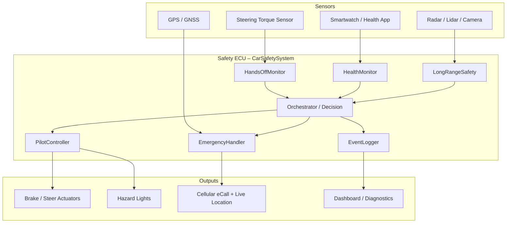

# Car Safety System – Circuit & Architecture Diagram

This document describes the **hardware-style circuit view** and the **software architecture** of the automated car safety system.

---

## 1. High-Level System Block Diagram (Circuit Style)

```
                    ┌────────────────────────────────────────────────────────────────┐
                    │                    VEHICLE POWER (12V / 24V)            │
                    │                         │                               │
                    │              ┌──────────┴──────────┐                    │
                    │              │   Power Distribution │                    │
                    │              │   + Fuse / Relay Box  │                    │
                    │              └──────────┬──────────┘                    │
                    │         ┌───────────────┼──────────────┐               │
                    │         ▼               ▼               ▼               │
┌──────────────┐   ┌──────────────┐  ┌──────────────┐  ┌──────────────┐      │
│  Steering    │   │  GPS / GNSS  │  │  Radar/Lidar │  │  Camera /    │      │
│  Torque      │   │  Module      │  │  Long-range  │  │  Vision ECU  │      │
│  Sensor      │   │              │  │  Sensor      │  │              │      │
│  (Nm)        │   │  Lat/Lon     │  │  (obstacles) │  │              │      │
└──────┬───────┘   └──────┬───────┘  └──────┬───────┘  └──────┬───────┘      │
       │                  │                 │                 │               │
       │ analog/CAN       │ UART/CAN        │ CAN/Ethernet    │ Ethernet      │
       ▼                  ▼                 ▼                 ▼               │
┌─────────────────────────────────────────────────────────────────────┐ │
│                         SAFETY ECU / DOMAIN CONTROLLER                   │ │
│  ┌──────────────────────────────────────────────────────────────────┐ │ │
│  │  CarSafetySystem (Python / ROS 2 node)                              │ │ │
│  │                                                                     │ │ │
│  │  ┌────────────┐  ┌────────────┐  ┌────────────┐  ┌───────────┐ │ │ │
│  │  │ HandsOff    │  │ Health      │  │ LongRange   │  │ Pilot      │ │ │ │
│  │  │ Monitor     │  │ Monitor     │  │ Safety      │  │ Controller │ │ │ │
│  │  └──────┬──────┘  └──────┬──────┘  └──────┬──────┘  └─────┬──────┘ │ │ │
│  │         │                │                │               │        │ │ │
│  │         └───────────────┴───────────────┴──────────────┘        │ │ │
│  │                              │                                      │ │ │
│  │                    ┌────────▼─────────┐                            │ │ │
│  │                    │  Safety Decision  │                            │ │ │
│  │                    │  & Orchestrator   │                            │ │ │
│  │                    └────────┬─────────┘                            │ │ │
│  │         ┌───────────────────┼───────────────────┐                 │ │ │
│  │         ▼                    ▼                    ▼                 │ │ │
│  │  ┌────────────┐     ┌────────────┐      ┌────────────┐          │ │ │
│  │  │ Emergency   │     │ Event       │      │ Diagnostics │          │ │ │
│  │  │ Handler     │     │ Logger      │      │ Publisher   │          │ │ │
│  │  └──────┬──────┘     └────────────┘      └────────────┘          │ │ │
│  └────────┼─────────────────────────────────────────────────────────┘ │ │
│            │                                                             │ │
└───────────┼──────────────────────────────────────────────────────────────┘ │
             │                                                               │
     ┌───────┴───────┬─────────────────┬─────────────────┐                 │
     ▼               ▼                  ▼                  ▼                 │
┌─────────┐   ┌────────────┐   ┌─────────────┐   ┌─────────────┐         │
│ Cellular│   │  Actuators  │   │  Hazard      │   │  Dashboard / │         │
│ Modem   │   │  (Brake /   │   │  Lights      │   │  HMI         │         │
│ (eCall) │   │   Steer /   │   │  + Siren     │   │              │         │
│         │   │   Throttle) │   │              │   │              │         │
└────┬────┘   └──────┬──────┘   └─────────────┘   └─────────────┘         │
     │               │                                                       │
     ▼               ▼                                                       │
  911 / 112     Vehicle Motion                                               │
  Hospital      Control (via                                                 │
  Contacts      Drive-by-Wire)                                               │
                    └────────────────────────────────────────────────────────────────┘
```

---

## 2. Sensor → ECU → Actuator Signal Flow

```
  STEERING WHEEL
       │
       │ torque
       ▼
  [Torque Sensor] ──analog/CAN──► [SAFETY ECU]
                                       │
  SMARTWATCH / HEALTH APP              │
       │                               │
       │ BLE / Wi-Fi / App             │
       ▼                               │
  [Health Gateway] ──JSON/String──► [SAFETY ECU]
                                       │
  RADAR / LIDAR / CAMERA               │
       │                               │
       │ object list                   │
       ▼                               │
  [Perception ECU] ──CAN/Eth──► [SAFETY ECU]
                                       │
  GPS / IMU                            │
       │                               │
       │ lat, lon, heading             │
       ▼                               │
  [Localization] ──CAN/UART──► [SAFETY ECU]
                                       │
                     ┌────────────────┼────────────────┐
                     │                 │                 │
                     ▼                 ▼                 ▼
              [Brake Actuator]  [Steer Actuator]  [Hazard Lights]
                     │                 │                 │
                     ▼                 ▼                 ▼
                 Deceleration      Pull-over /        Flashing
                                  Lane change

                     │
                     ▼
              [Cellular Modem]
                     │
                     ├──► 911 / 112 (eCall)
                     ├──► Hospital notify
                     └──► Emergency contacts + live GPS
```

---

## 3. Software Architecture (Mermaid – renders on GitHub)



---

## 4. How the pieces map to code

| Circuit / Block          | Code file / class                          |
|--------------------------|--------------------------------------------|
| Steering torque sensor   | `HandsOffMonitor` + `update_steering_torque` |
| Smartwatch health        | `HealthMonitor` + `HealthData`             |
| Long-range perception    | `LongRangeSafety` + `Obstacle`             |
| Safety ECU core logic    | `CarSafetySystem` (`car_safety_core.py`)   |
| Pilot / drive-by-wire    | `PilotController`                          |
| eCall + live location    | `EmergencyHandler`                         |
| Hospital routing         | `HospitalFinder`                           |
| ROS 2 parameter server   | `safety_node.py` (ROS 2 package)           |
| Live dashboard           | `car_safety_preview.html`                  |
| Terminal animation       | `car_safety_demo_animation.py`             |

---

*This is an educational / prototyping diagram. Real vehicle systems require certified hardware, functional-safety processes (ISO 26262), and proper electrical design.*
